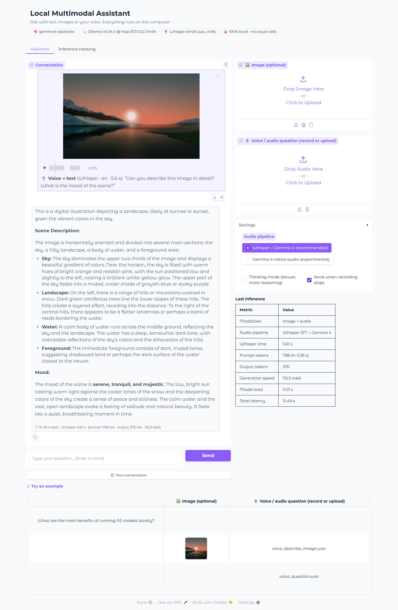
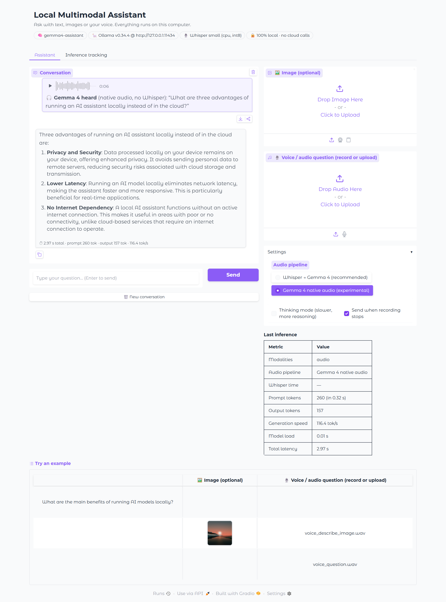
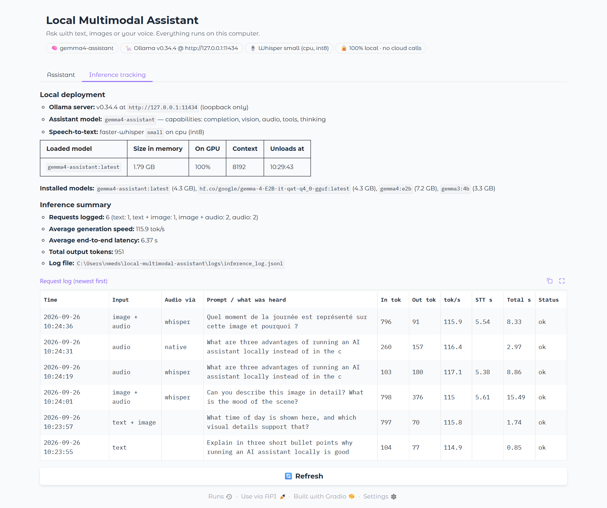

# Local Multimodal AI Assistant (Ollama + Gemma 4 + Whisper)

A private assistant that runs entirely on this PC (RTX 4070 Laptop, 8 GB VRAM) and accepts
**text**, **images** and **voice/audio**. No cloud APIs: Ollama listens on `127.0.0.1:11434`,
the web UI on `127.0.0.1:7860`, Gradio analytics are disabled, and Whisper loads from the local cache.

```
 text ─────────────────────────────┐
 image ──► normalise (JPEG ≤1600px)─┼──► Ollama /api/chat ──► gemma4-assistant (Gemma 4 E2B, GPU)
 voice ─┬► faster-whisper (local) ──┘        │                      │
        └► 16 kHz WAV (native audio) ────────┘                      ▼
                                     inference tracking ──► logs/inference_log.jsonl + UI tab
```

## 1. Ollama setup
Ollama **v0.34.4** is installed (`%LOCALAPPDATA%\Programs\Ollama`) and serves on the loopback address only.

## 2. Gemma 4 deployment
```bash
ollama pull hf.co/google/gemma-4-E2B-it-qat-q4_0-gguf   # Google's official Gemma 4 E2B (QAT Q4_0) + vision/audio projector
ollama create gemma4-assistant -f Modelfile             # recommended sampling + 8k context
```
`ollama show gemma4-assistant` reports capabilities **completion, vision, audio, tools, thinking**.
It runs 100% on the GPU at ~110–120 tok/s.

> **Known issue found during setup:** on Ollama 0.34.4 (Windows) the library tag `gemma4:e2b`
> handles text and audio correctly but returns nonsense for images: its bundled vision weights are
> converted at load time (`handle_gemma4_clip … translating` in `server.log`). The same prompt
> works with `gemma3:4b` and with Google's GGUF above, which ships a native projector.

## 3. Pipeline (three modalities)
| Input | Route |
|---|---|
| Text | sent as-is |
| Image (upload / webcam / clipboard) | normalised to RGB JPEG, sent in `images` |
| Voice / audio file or microphone | **Whisper → Gemma 4** (default): faster-whisper `small` transcribes locally (multilingual), the transcript is the question · **Gemma 4 native audio**: resampled to 16 kHz mono WAV and given to Gemma 4's own audio encoder; it replies `Heard: …` then answers |

Code: `assistant/core.py` (routing + streaming), `assistant/speech.py` (Whisper), `assistant/tracking.py`
(per-request metrics: tokens, tok/s, prompt eval, model load, Whisper time, latency).

## Run
```bash
py -3.11 -m venv .venv && .venv\Scripts\pip install -r requirements.txt
.venv\Scripts\python app.py                    # web UI → http://127.0.0.1:7860
.venv\Scripts\python cli.py --image samples\sunset_lake.jpg --audio samples\voice_describe_image.wav
.venv\Scripts\python cli.py -i                 # interactive: /image PATH, /audio PATH
.venv\Scripts\python -m pytest                 # 21 unit + 5 integration tests (26 pass)
.venv\Scripts\python scripts\capture_screenshots.py   # re-creates screenshots/ (app must be running)
```
Settings via env vars: `ASSISTANT_MODEL`, `ASSISTANT_NUM_CTX`, `WHISPER_MODEL` (e.g. `base` = faster),
`WHISPER_DEVICE`, `OLLAMA_HOST`.

## 4. Test results (screenshots)
The voice clips in `samples/` were generated with the offline Windows speech synthesizer
(`scripts/make_voice_samples.ps1`) so the tests are reproducible; the microphone button in the UI
works the same way. Screenshots were taken by Playwright driving the real UI in Edge (files are
uploaded through the page; the chat panel is expanded to full height for the capture).

| # | Interaction | Result |
|---|---|---|
| 01 | Text question | 3-bullet answer, 0.85 s |
| 02 | Image + typed question | "sunrise or sunset", low sun, warm hues · 1.74 s |
| 03 | **Voice asks to describe a local image** (Whisper) | exact transcript + detailed description and mood · 15.5 s |
| 04 | Voice-only question (Whisper) | exact transcript + answer · 8.9 s |
| 05 | Voice-only question (Gemma 4 native audio) | "Gemma 4 heard: …" + answer · 3.0 s |
| 06 | French voice question about the image | Whisper detects `fr`, answer in French · 8.3 s |
| 07 | Inference tracking tab | Ollama status (model 100% on GPU), summary, request log |





Note: Whisper `small` on this laptop's CPU takes ~5 s per 5-s clip while the GPU is busy
(thermal sharing); native audio mode avoids that step. GPU Whisper needs NVIDIA cuBLAS/cuDNN 12 libraries.
